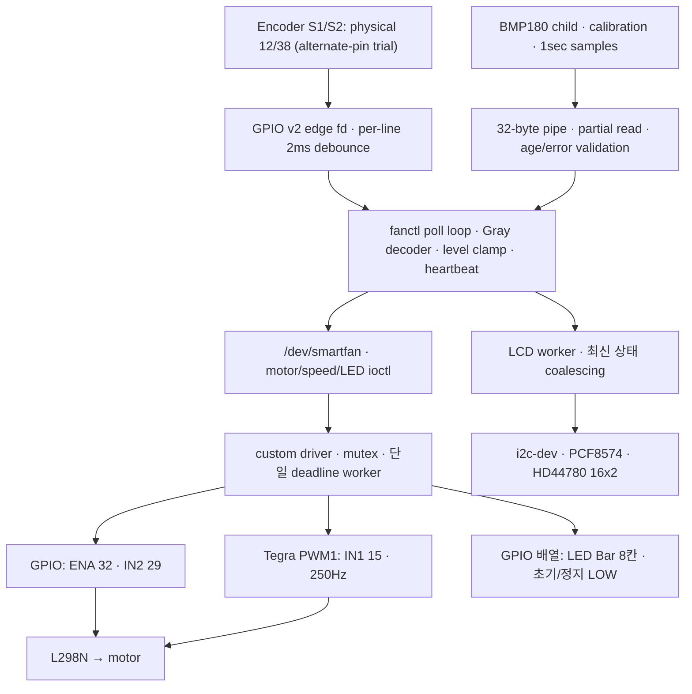
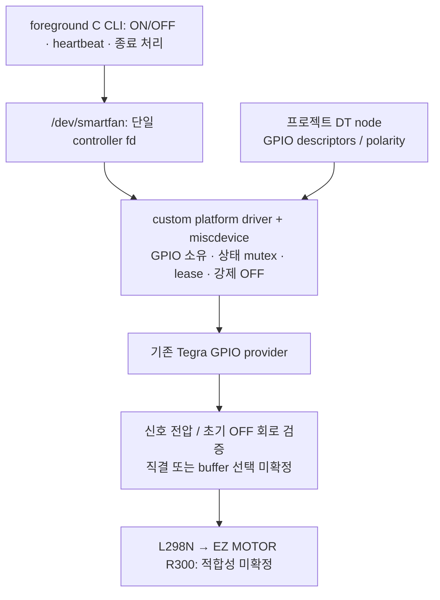

# Software Architecture 및 Build 설계

상태: 1단계 완료. Encoder 진단을 보류하고 LED Bar 구현·software 검증 완료,
새 DT 설치와 실물 점등 시험 대기.
최신 상태는 LED Bar 실물 시험 성공 보고, LCD 구현 및 100kHz DT 준비 완료다.
LCD 전압 변환 배선과 주소/mapping 검증은 남아 있다.
최신 통합은 BMP180 sensor child와 AUTO 정책을 포함한다. 실제 센서 측정/IPC는
확인했고 AUTO 모터 통합 시험과 LCD 대비 개선은 남아 있다.
Software Architecture / Kernel Driver / Build Integration / Test Reliability / Hardware Safety를
세 서브에이전트와 주 에이전트가 검토하여 통합했다.

## 2단계 구조



- Encoder 입력은 userspace GPIO v2 line request 한 개로 받는다. Kernel GPIO provider가 edge/debounce를 제공하며 별도 IRQ Driver를 만들지 않는다.
- 두 신호의 Gray 전이를 한 바퀴(4 edges)씩 decode한다. 방향·상한/하한은 event 순서대로 적용한다. queue sequence gap은 partial cycle을 버리고 현재 값을 재동기화한다.
- `poll()` 한 loop에서 stdin, Encoder, signal self-pipe와 heartbeat를 처리한다. 한 번에 최대32개 event만 읽어 heartbeat 처리가 밀리지 않도록 한다.
- Motor PWM은 기존 Tegra provider를 `devm_pwm_get()`/`pwm_apply_state()`로 사용한다. IN1 GPIO를 함께 요청하지 않는다. PWM provider default pinctrl이 PN1 SFIO를 유지한다.
- EN GPIO를 OFF interlock으로 유지한다. 오류/종료 시 EN부터 LOW로 내린다.
- level0 정지, level1..5 duty60/70/80/90/100%. 낮은 단계 기동 시100%200ms boost 후 선택 duty로 전환한다. duty와 실제 RPM은 동일하지 않으며 실물 보정이 필요하다.
- OFF 중 Encoder는 풍속 선택만 변경하며 자동으로 켜지지 않는다. `on`으로 재시작한다. `speed 0` 뒤 `on`은 마지막 nonzero 단계로 복귀한다.
- Boost, lease2초, 최대ON30초는 한 delayed worker로 처리한다. 풍속 변경은 최대ON deadline을 연장하지 않는다.
- 기존 ioctl1..3 ABI/크기는 유지하고 SET_SPEED4/GET_SPEED5를 추가했다. Stage1 DT는 GPIO fallback(0/5단계)을 지원한다. 새 CLI도 이전 module의 ON/OFF를 지원한다.
- LED Bar는 optional `led-gpios` 8개를 Driver가 소유한다. SET_LEDS6/GET_LEDS7를 추가했으며, LED DT가 없는 이전 구성도 지원한다. 자동 모드에서는 running/level에 동기화하고 stop/close/timeout에도 모두 끈다. OFF 전용 시험 모드는 모터를 시작하지 않는다.
- AUTO는 SET_AUTO8에서 sample의 BOOTTIME age와 보호 정지 latch를 같은 kernel mutex로 검사한다. 자동 요청은 rearm=0, 명시적 ON만 rearm=1이다. CAP_AUTO가 없는 module에서는 AUTO를 거부한다.
- LCD 종료 join은 CLOCK_MONOTONIC 기준2초로 제한한다. timeout 후에는 살아 있는 worker 메모리를 해제하지 않고 main이 오류로 종료한다. worker의 control signal을 차단해 main이 신호 처리를 소유한다.
- LCD는 `--lcd` 선택 시 userspace worker 한 개가 I²C fd와 모든 송수신을 소유한다. Main loop는 최신 상태만 전달하고 통신을 기다리지 않는다. 종료는 motor stop/close 후 LCD worker join 순서다. LCD 오류와 SIGKILL에서 표시가 남을 수 있으며 물리적 motor 상태의 증거로 사용하지 않는다.
- BMP180 child는 I²C measurement만 수행하고 controller fd는 CLOEXEC로 승계하지 않는다. Parent가 모든 mode/arm/hysteresis/ON/OFF를 결정하고, sensor fault/EOF/stale에서는 AUTO를 disarm한다. LCD와 sensor의 I²C blocking은 main heartbeat와 분리된다. Parent death signal과 signal/waitpid로 child를 정리한다.

## 보존한 1단계 구조



직접 구현한 Driver는 **실제 모터 신호 출력과 정지 정책**을 맡는다.
기존 Tegra GPIO/PWM/I²C controller Driver는 그대로 재사용한다.
Userspace는 모드·풍속 정책·센서·화면을 담당하고 GPIO를 Driver와 중복 점유하지 않는다.

- `platform_driver` + DT의 `enable-gpios`, `in1-gpios`, `in2-gpios`로 배선 표현.
- `miscdevice`로 동적 minor의 character device 제공. fixed major를 만들 필요 없음.
- 소수의 `ioctl()`로 상태 조회/ON/OFF/heartbeat 제공. fixed-width UAPI, 범위 검사, ABI version 명시.
- 단일 제어 fd만 허용, 두 번째 open은 `EBUSY`. CLI는 `O_CLOEXEC` 사용.
- EN을 LOW로 먼저 요청한 뒤 방향을 설정. ON은 방향 설정 후 EN 활성화, OFF는 EN 비활성화부터 수행.
- polarity는 DT active-high 조건으로 확인. 논리 LOW와 실제 전압 LOW를 혼동하지 않는다.
- 정상 close, probe 실패, remove/unload, lease 만료 시 OFF. 재연결/heartbeat만으로 자동 재시작하지 않는다.

`fanctl on` 후 CLI가 즉시 종료하면 fd release가 OFF시키므로,
1단계 CLI는 foreground로 fd를 유지하며 명령을 받는 형태로 설계한다.
신호 handler에서는 flag만 설정하고 main loop에서 ioctl/close를 수행한다.
lease 시간과 최대 연속 ON 시간은 구현 단계에서 명시하고 시험한다.

## Concurrency / lifetime / 장애

- owner/state/deadline/removed를 하나의 mutex로 보호한다.
- GPIO `_cansleep` 및 PWM API는 process/workqueue context에서 실행한다.
- `delayed_work`가 wraparound-safe deadline을 검사하여 OFF. timer/IRQ context에서 sleeping GPIO를 호출하지 않는다.
- OFF 후 오래된 heartbeat로 다시 ON되지 않도록 한다. 이전 session의 work가 새 owner의 deadline을 취소하지 않도록 현재 상태를 재확인한다.
- 열린 fd는 `.owner = THIS_MODULE`로 정상 module unload를 막는다. platform unbind 수명은 별도로 `kref`/removed 상태로 처리한다.
- remove는 removed 표시와 OFF → mutex 해제 → device 등록 해제 → work 동기 취소 → 참조 해제 순서를 검토한다.
- state mutex를 잡은 채 `misc_deregister()`/`cancel_delayed_work_sync()`를 호출하지 않는다. fd callback은 removed 이후 하드웨어 접근을 거부한다.

SSH 단절 자체를 kernel lease가 감지하는 것은 아니다. 남은 process가 heartbeat를 계속 보내면 ON도 지속될 수 있다.
foreground HUP/EOF 처리 + kernel lease + 갱신으로 무한 연장되지 않는 최대 ON 시간을 조합한다.
SIGKILL은 마지막 fd가 닫혀야 release가 실행되므로 fork/dup 상속도 주의한다.
Kernel hang/전원 장애는 software timeout으로 보장할 수 없다.
L298N EN 기본 OFF 회로 및 전원 순서 검증이 필요하다. GPIO 직결/외부 buffer 선택은 전압 검사 결과로 판단한다.
OFF는 전기적 구동 중단이며 날개의 즉시 정지와 다르다.

API 근거: 현재 headers의 `include/linux/{gpio/consumer.h,pwm.h,platform_device.h,miscdevice.h,workqueue.h,kref.h}`.
[GPIO descriptor 문서](https://docs.kernel.org/5.15/driver-api/gpio/consumer.html),
[PWM 문서](https://docs.kernel.org/5.15/driver-api/pwm.html).
현재 vendor headers에는 `.remove_new` 및 `pwm_apply_state()`가 존재한다.

## 확장 방향

| 단계 | 선택 방향 / 이유 |
|---|---|
| Encoder/PWM | GPIO v2 userspace edge/Gray decoding 구현. 현재 kernel에 rotary-encoder module 없음 |
| PWM | hardware PWM 우선. EN GPIO interlock을 유지하고 IN1을 GPIO→PWM으로 전환하는 후보. 같은 pin의 GPIO/PWM 동시 점유 금지. OFF는 EN LOW로 보장하고 실제 파형 확인 |
| LCD | chip/pin 연결 확인 후 i2c-dev userspace. 이미 kernel Driver가 점유한 주소와 병행 접근 금지 |
| LED BAR | 강의 LED+330Ω array 방식으로 한 칸부터 평가. 추가 Driver는 밝기/전류/반복 동작 검증 결과로 선택 |
| BMP180 | i2c-dev sensor child 구현. Calibration/보정식,1초 측정과 온도 AUTO 연동 완료. Kernel bmp280 미설정 환경에서 사용하며 습도 기능은 없음 |
| Multi-process | 통합이 안정된 후 controller만 모터 fd 소유. display/logger 등 분리 필요가 생길 때 bounded IPC 도입 |
| Multi-thread | 센서/표시 I/O가 이벤트 처리를 막는 근거가 있을 때 도입. 처음부터 thread 추가하지 않음 |
| 고급 확장 | 둘째 날 안정 버전 확보 후 판단. Qt/Shared Memory 등은 필수 아님 |

Upstream 근거: [rotary_encoder.c](https://raw.githubusercontent.com/torvalds/linux/v5.15/drivers/input/misc/rotary_encoder.c),
[bmp280-i2c.c](https://raw.githubusercontent.com/torvalds/linux/v5.15/drivers/iio/pressure/bmp280-i2c.c).

## Repository / Build 계획

현재 1단계 구조는 아래와 같다.

```text
driver/smartfan.c       platform/miscdevice Driver
driver/Kbuild          external module Build
include/smartfan_uapi.h fixed-width ioctl ABI
app/fanctl.c           foreground CLI / dry-run
dts/smartfan.dts        device + 세 motor pad의 output pinctrl overlay
tests/test_fanctl.py    dry-run CLI integration test
Makefile               app / module / dt / test
.gitignore             산출물 제외
scripts/prepare-dt.py   현재 boot 설정 기반 offline DT/config 준비
scripts/install-dt.sh   승인된 DT 설치, hash검증/backup/atomic publish
docs/                  조사 · 배선 · Build/Run · 상태
```

`KDIR ?= /lib/modules/$(uname -r)/build`와 external Kbuild `make -C $(KDIR) M=<driver> modules`를 사용한다.
Native C CLI는 GCC로 warning을 켜고 빌드한다. 다른 버전 source를 대체하지 않는다.
DT compile과 실제 boot 설치를 분리하고, 기본 build target은 sudo/load/설정을 수행하지 않는다.
`.ko`, `.o`, `.mod*`, `.cmd`, `Module.symvers`, `modules.order`, `.dtbo`, 실행 바이너리는 제외한다.
`/dev`, `/sys`, `/proc`, `/boot`는 runtime/system 상태이며 repository source와 구분한다.

## 구현한 1단계 동작

- Driver 기본 lease2초, 갱신 불가능한 연속 ON 상한30초. DT에서 제한 범위 내 설정 가능.
- 반복 ON은 lease만 갱신하며 기존30초 deadline은 유지. 만료 후 새 ON 명령을 명시적으로 입력하면 새 run 시작.
- Heartbeat는 OFF 상태를 ON으로 만들지 않음. GET/SET/heartbeat에서도 deadline을 확인해 늦은 work 처리에 따른 복구를 막음.
- fd release/suspend/shutdown/remove에서 OFF 요청, resume 자동 재시작 없음.
- CLI `poll()` + self-pipe와 분할 `read()`로 입력을 처리하고 250ms 이하 간격으로 heartbeat.
- 부분 명령/초과 길이/NUL을 완성된 ON 명령으로 오인하지 않음. EOF와 SIGINT/TERM/HUP에서 OFF 요청 및 close.
- Worker는 hard real-time 정지를 보장하지 않는다. Kernel hang/전원 문제에 대한 보장은 별도 회로 영역이다.
- `--dry-run`은 userspace 모사이며 실제 Driver의 workqueue/GPIO/정지 시험을 대체하지 않는다.
- 사용자 pad 조회로 high-Z 설정을 확인하여 GPIO output용 default pinctrl state를 추가했다.
