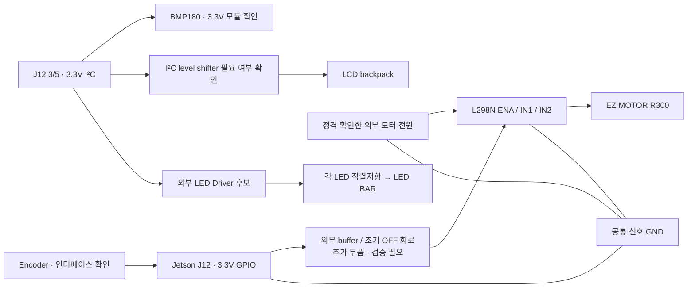

# 하드웨어 안전 검토 및 연결 후보

상태: **배선 승인 전 설계안. 이 문서의 후보 연결을 아직 실행하지 않는다.**
실물 사진·모터/전원 정격·buffer 회로가 확인되면 실제 Breadboard 배치와 저항 위치를 확정한다.
현재 목록만으로는 안전한 1단계 모터 구동 회로가 검증되지 않았다.

사진 두 장 확인 후 갱신: `EZ MOTOR R300`, LCD `1602A` 및 backpack의 `GND/VCC/SDA/SCL`,
Encoder `GND/S1/S2/KEY/+`를 확인했다. 단자별 상세 연결 후보와 남은 확인은 [wiring.md](wiring.md)에 관리한다.
사용자는 외부 전원 5V 사용 가능, 멀티미터 사용 가능, 모터 3.3V 구동 계획을 전달했다.
실제 공급장치 최대 전류와 모터 정격은 여전히 미확인이다.

`docs/img/` 상세 사진 반영: 최신 [간단 연결표](pin-connections.md)를 참고한다.
BMP180/GY-68 및 VIN/GND/SCL/SDA, L298 terminal/Header label, motor IN+/IN−,
Encoder `5V`와 `103` 저항, WCNLB8-SR12 및 9A331G 9pins를 확인했다.
아래 초기 조사에서 미확인이었던 label은 새 표로 보완하며, 전기적 검증은 별도다.

**구동 판단 정정:** [강의/TXB0108 재검토](lecture-review.md)에 따라 LED+저항 array 직결 시험을 검토한다.
추가 LED Driver를 무조건 필수로 요구했던 판단과 20µA/100µA 비교만으로 L298 buffer 필수라고 한 판단은 정정한다.
외부 전원5V/최대A모름, 추가 buffer/level shifter 확보 불가 및 실제 J12/Breadboard 사진을 확인했다.

## 확인된 자료와 실물 미확인 항목

| 부품 | 자료에서 확인한 내용 | 실물에서 확인할 내용 |
|---|---|---|
| Jetson | DT상 P3767-0005 / P3768-0000 | Carrier 실제 모델/revision, J12 pin1 방향, 현재 배선 |
| EZ MOTOR R300 | 사진에서 YwRobot/EZ MOTOR R300, 2선 connector 확인; 공식 정격 미확인 | motor 본체 표시·극성·판매처, 정격 전압/정상·기동·stall current, 날개 고정 |
| L298N | ST IC datasheet 확인 | 모듈 회로, ENA/ENB 및 regulator 점퍼, diode/방열/전원 단자 |
| Encoder | 사진에서 module 5핀 GND/S1/S2/KEY/+ 확인 | 뒷면 회로, pull-up 및 동작 전압 |
| LCD | 사진에서 1602A 및 I²C backpack GND/VCC/SDA/SCL 확인; PCF8574는 추정 | chip 문자, pull-up 전압, address strap, expander→LCD pin 연결 |
| BMP180 | IC 0x77, 온도/기압, 3.3V 계열 사용 가능 | 실제 chip/module, regulator, pull-up 연결 및 VCC 단자 |
| LED BAR | WCNLB8-SR12 자료상 독립 LED 8개 | 실물과 자료의 동일성, pin1 방향, 색상/극성 |
| 9A331G | 정확한 제조사·내부 연결 미확인 | pin 수/공통 pin 표시, bussed/isolated 구성, 저항 및 정격 |
| 모터용 전원 | 미확인 | 출력 전압·전류·극성, current limit, 케이블 용량 |

사진은 모터, L298N, LCD/BMP180/Encoder의 앞뒷면, LED/저항 network 표시,
Carrier/J12와 현재 배선, 전원 라벨을 우선한다. 모터 라벨/판매처와 전원 정격이 1단계의 가장 큰 선행 조건이다.

## Carrier GPIO 제약

[NVIDIA Carrier Specification SP-11324-001 v1.3, pp.21–23](https://developer.nvidia.com/downloads/assets/embedded/secure/jetson/orin_nano/docs/jetson_orin_nano_devkit_carrier_board_specification_sp.pdf)
기준 J12 신호는 3.3V이다. 일반 GPIO는 TXB0108을 경유하며 표의 구동 특성은 **±20µA**다.
실물 Carrier 동일성 확인 전에는 이 값을 사용자 보드의 실측값으로 표현하지 않는다.
20µA는 논리 출력 전압 보장 조건이며 초과 즉시 손상을 뜻하는 절대 한계가 아니다.

- 일반 GPIO에 외부 pull-up/down을 붙이면 **50kΩ보다 커야 한다**.
- 지급된 330Ω/1kΩ/4.7kΩ/10kΩ를 일반 GPIO의 직접 pull 저항으로 쓰지 않는다.
- 모터 전원이나 검증되지 않은 부하를 GPIO에서 구동하지 않는다. LED+저항 직결은 별도로 전류/밝기/전압을 확인한다.
- `3.3V 논리`만 일치한다고 DC 부하/용량/전원 순서까지 적합한 것은 아니다.
- I²C SDA/SCL은 TXB GPIO와 별개의 open-drain 연결이다. I²C 전용 level shifter를 사용하며 일반 push-pull buffer로 대체하지 않는다.

[TI TXB0108 datasheet](https://www.ti.com/lit/ds/symlink/txb0108.pdf)도 약한 DC 출력 및 외부 pull 저항 제약을 설명한다.
긴 jumper/큰 capacitance와 board 자체 pull-up/down도 검토 대상이다.

## L298N / 모터

[ST L298 datasheet Rev.5, pp.3–9](https://www.st.com/resource/en/datasheet/l298.pdf):

- Logic supply VSS: 4.5–7V, typical 5V. 모터 supply VS와 구분한다.
- IN/EN High 최소 2.3V; High input current 최대 100µA.
- 3.3V는 논리 threshold를 만족하지만, GPIO 표의 DC 구동 능력으로 **직결이 보장되는 것은 아니다**.
- 각 channel DC 2A는 absolute maximum. 모듈의 연속 운전 가능 전류로 사용하지 않는다.
- Bridge 총 전압 강하 최대: 1A에서 3.2V, 2A에서 4.9V.
- 모터 실효 전압은 공급 전압에서 bridge drop과 배선 drop을 뺀 값이다. 동작점과 기동전류·손실·방열을 함께 검증한다.
- 유도성 부하에는 외부 freewheel diode가 필요하다. 모듈 장착 여부 및 정격을 확인한다.
- EN LOW는 구동을 해제하며 관성 정지한다. 즉시 기계적 정지는 보장하지 않는다.

모터 stall 상태를 손으로 만들거나 검증되지 않은 전압을 올려 drop을 보상하지 않는다.
정격 자료와 current-limited 전원으로 안전한 기동 검증 방법을 먼저 정한다.
저전압 모터에 L298 drop이 지나치게 크면 모터 정격에 맞는 MOSFET bridge/module 확보를 검토한다.

### 외부 buffer 후보

[TI SN74AHCT125 datasheet](https://www.ti.com/lit/ds/symlink/sn74ahct125.pdf):
VCC 4.5–5.5V, VIH 최소 2.0V, VIL 최대 0.8V, input leakage 최대 ±1µA,
출력 권장 ±8mA. **Jetson → buffer → L298** 방향의 후보이며 최종 선정은 아니다.

추가 검토/확보: buffer, 0.1µF bypass, 적절한 weak pull 저항, OE/default-OFF 회로,
5V logic supply 및 전원 차단 시 입력/출력 거동. 지급 부품 목록에는 이 buffer와 >50kΩ 저항이 없다.
buffer 출력/L298측 EN pull-down에는 조건에 맞는 10kΩ를 검토할 수 있지만,
이를 Jetson GPIO측에 그대로 배치하지 않는다. 5V pull-up된 OE를 Jetson에 직접 연결하지 않는다.
buffer 전원만 남거나 Jetson이 먼저 켜지는 경우도 시험해야 한다.

## 전체 구성 후보

모터 supply 양극과 Jetson supply 양극을 임의로 합치지 않는다.
모터와 Jetson 신호는 공통 GND가 필요하지만, 모터 전류는 굵은 별도 return으로 공급장치/L298으로 돌아가야 한다.
모터 전류를 Jetson GND jumper나 Breadboard 신호 rail로 흘리지 않는다.
Jetson의 시스템 냉각팬과 이 프로젝트의 외부 선풍기를 구분한다.

## J12 연결 후보: 물리 pin과 Linux 식별 분리

다음은 **pin 예약안**이다. 실물·padmux 확인 후 변경될 수 있으며 전원을 연결하는 지시가 아니다.
DT상 Carrier와 로컬 NVIDIA `Jetson/GPIO/gpio_pin_data.py`를 대조했다.
GPIO 후보들은 `gpioinfo`에서 consumer 없이 보이지만 실제 mux/부팅 초기 전압은 미확인이다.

| J12 물리 pin | 신호 / SoC port | 현재 Linux 식별 | 용도 후보 |
|---|---|---|---|
| 1 / 17 | 3.3V supply | GPIO 아님 | 검증된 low-power sensor 논리 전원 |
| 2 / 4 | 5V supply | GPIO 아님 | 필요·용량 검증 후 logic만; 모터 supply 사용 금지 |
| 6 | GND | GPIO 아님 | 신호 기준 GND 후보 |
| 9/14/20/25/30/34/39 | GND | GPIO 아님 | 추가 신호 GND |
| 32 | GPIO07 / PG.06 | `gpiochip0` offset 41; DT `TEGRA234_MAIN_GPIO(G, 6)` | buffer를 거친 ENA; 정지 interlock 유지 |
| 15 | GPIO12 / PN.01 | `gpiochip0` offset 85; DT `TEGRA234_MAIN_GPIO(N, 1)` | buffer를 거친 IN1; 1단계 GPIO, 2단계 PWM1 후보 |
| 29 | GPIO01 / PQ.05 | `gpiochip0` offset 105; DT `TEGRA234_MAIN_GPIO(Q, 5)` | buffer를 거친 IN2; 한 방향 제어 |
| 7 | GPIO09 / PAC.06 | `gpiochip0` offset 144; DT `TEGRA234_MAIN_GPIO(AC, 6)` | Encoder A 후보 |
| 31 | GPIO11 / PQ.06 | `gpiochip0` offset 106; DT `TEGRA234_MAIN_GPIO(Q, 6)` | Encoder B 후보 |
| 3 / 5 | I2C1 SDA / SCL, PDD.02 / PDD.01 | `c250000.i2c` → 현재 `/dev/i2c-7` | BMP180 / 적합성 확인한 LCD bus |
| 27 / 28 | I2C0 SDA / SCL, PDD.00 / PCC.07 | controller/bus 대응 추가 확인 | 이번 프로젝트에서는 사용하지 않음 |
| 11 / 36 | UART RTS / CTS | runtime DT `uarta` | 기존 설정 보존, 사용하지 않음 |

`gpiochip0` 번호도 부팅 환경에 따라 바뀔 수 있어 chip label/port를 함께 확인한다.
**cdev line offset과 DT GPIO specifier의 숫자는 같다고 가정하지 않는다.**
DT에서는 `dt-bindings/gpio/tegra234-gpio.h`의 macro와 polarity를 사용한다.
전역 Linux GPIO 번호를 물리 pin 번호 대신 저장하지 않는다.

Pin15 PWM 후보: DT symbol `pwm1`, `3280000.pwm` channel 0, 현재 `pwmchip2`.
IN1을 PWM으로 바꾸면 같은 GPIO descriptor는 점유하지 않는다.
EN은 GPIO interlock으로 유지하여 PWM disable의 실제 출력 수준에 의존하지 않게 설계한다.
Pin32에는 PWM7 alternate도 있지만 위 설계에서는 EN GPIO로만 사용한다.

## 확장 부품

### BMP180

Bosch BMP180 datasheet Rev.2.5: VDD 1.8–3.6V, VDDIO 1.62–3.6V, **7-bit address 0x77**.
0xEE/0xEF는 R/W bit 포함 표현이다. 온도·기압을 읽으며 습도를 측정하지 않는다.
온도 기반 AUTO에는 적합하지만 모터/Jetson 열원에서 떨어져 설치한다.
모듈의 regulator/pull-up을 확인하기 전 5V를 공급하지 않는다.
[Bosch 원본 datasheet의 보관본](https://cdn-shop.adafruit.com/datasheets/BST-BMP180-DS000-09.pdf).
주소만 맞다고 실제 sensor가 BMP180임을 판정하지 않는다.

Carrier 자료 기준 I2C1 pins3/5에는 module 2.2kΩ pull-up이 있고,
I2C0 pins27/28에는 1.5kΩ pull-up이 있다. 모듈 추가 pull-up의 병렬 저항과 rise time을 확인한다.
원래 bus에 임의로 4.7kΩ를 더 붙이지 않는다.

### LCD

PCF8574를 사용한 5V backpack이라면 SDA/SCL의 5V pull-up이 문제다.
[NXP PCF8574 datasheet](https://www.nxp.com/docs/en/data-sheet/PCF8574_PCF8574A.pdf)의 VIH는 0.7×VDD이므로
5V supply에서 3.3V High도 보장되지 않는다. pull-up만 3.3V로 바꾸면 해결된다고 가정하지 않는다.
검증된 bidirectional I²C level shifter 또는 실제로 3.3V에서 동작하는 전체 LCD 회로가 필요하다.
주소와 expander→LCD bit mapping은 실물 확인 후 결정한다.

### LED BAR / 저항 network

[WCN WCNLB8-SR12 datasheet](https://www.wcnopto.net/uploads/file/20190102/1546423672226980.pdf)의
검색 인덱스에서 8개 독립 LED / 16pins를 확인했다. 직접 PDF 다운로드는 제조사 서버 인증서 문제로 실패했다.
자료상 anode/cathode 쌍은 A 1/16, B 2/15, C 3/14, D 4/13, E 5/12, F 6/11, G 7/10, H 8/9.
이는 **실물 pin1 방향과 PDF 도면 대조 전 배선표로 사용하지 않는다**.
VF 자료값은 typical 2.00V / maximum 2.60V @20mA, 각 LED absolute maximum IF 25mA.
absolute maximum을 목표 전류로 쓰지 않는다.

각 LED에 전류 제한을 둔다. 강의 p.1의 LED+330Ω array 직결 구성을 한 칸부터 평가하고,
부하 때문에 내려가는 GPIO 전압과 실제 밝기를 확인한다. 외부 Driver/expander는 결과에 따라 선택한다.
`9A331G`를 330Ω bussed array라고 단정하지 않는다. 단독·무전원 부품의 저항 측정과 표시로 topology를 확인한다.
LED 표시의 사용성은 현재 부품으로 검증한다. LCD의5V I²C 보호 문제는 LED와 별개다.

### Encoder

핀 이름만으로 bare encoder/module 전압과 board pull-up을 판단하지 않는다.
3.3V supply, A/B/SW의 출력 회로 및 pull-up 전류를 먼저 확인한다.
TXB0108에 직접 접점과 10kΩ pull-up을 붙이는 일반적인 다른 보드용 회로를 그대로 복사하지 않는다.
필요하면 contact debounce 및 외부 3.3V input buffer를 검토한다. 5V 출력은 Jetson에 입력하지 않는다.

## Breadboard 설계 기준 / 미확정 연결

1. 실물 J12 pin1 표기와 홀수/짝수 열 방향을 확인한 뒤 물리 번호로 배선한다.
2. signal, 3.3V, 5V logic, motor supply rail을 구분하고 rail 중간 단절 여부를 무전원 continuity로 확인한다.
3. buffer는 중앙 홈을 가로질러 놓는 등 실제 package에 맞춰 배치하고 bypass를 VCC/GND 가까이 둔다.
4. 모터 current path는 L298 terminal과 적절한 전선으로 별도 구성한다. motor power는 신호 Breadboard를 거치지 않는다.
5. L298 ENA jumper/regulator jumper를 혼동하지 않는다. ON/OFF ENA jumper 제거는 실물 회로 확인 뒤 수행한다.
6. Jetson→buffer, buffer→L298, L298→motor를 각각 확인하고 motor 분리 상태에서 초기 EN LOW를 먼저 측정한다.
7. 같은 supply label이라도 다른 regulator 출력/외부 전원을 연결하지 않는다. 전원 양극 연결은 최종 회로에서 별도 지정한다.
8. 1단계 motor만 → Encoder/PWM → LCD → 가능한 LED/BMP180 순으로 추가하고 단계마다 검증한다.

**아직 지정할 수 없는 것:** buffer의 정확한 pin/OE 회로, L298 5V terminal 사용 방식,
모터 supply 전압/전류, sensor/backpack VCC, 저항 network 공통 pin, 최종 rail 연결.
이 항목을 추정하여 사용자가 그대로 연결하도록 안내하지 않는다.
